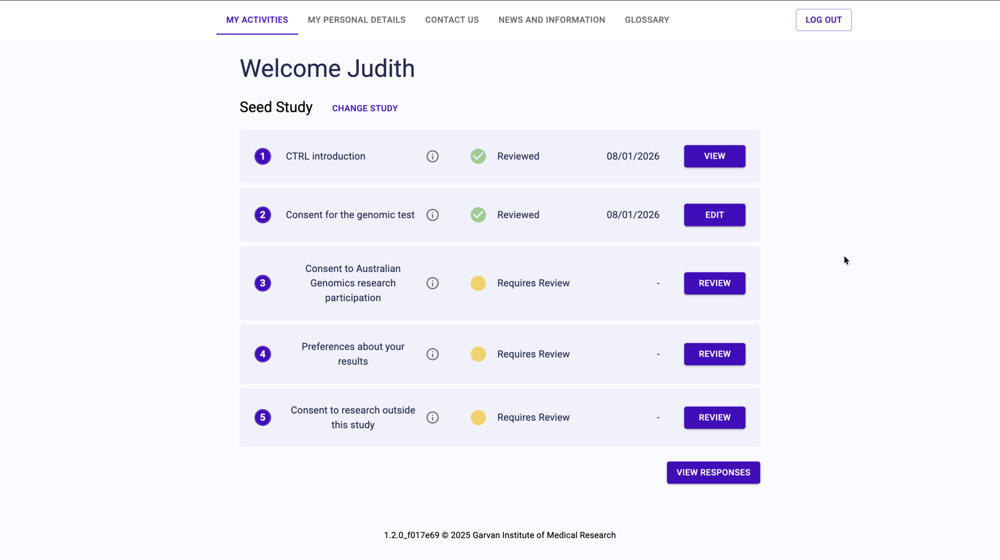
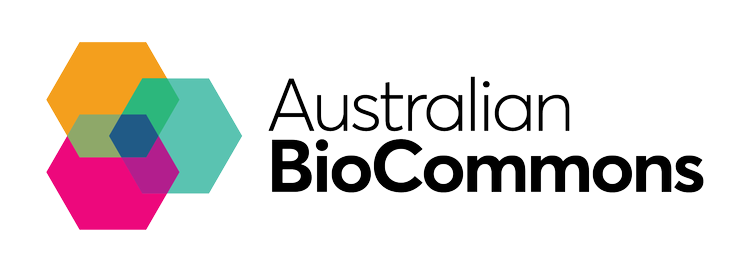

<div align="center">

  <h1>CTRL</h1>

  Dynamic Consent Management Platform

  [](https://github.com/Garvan-Data-Science-Platform/ctrl-next/actions/workflows/check.yml)
  [](https://github.com/Garvan-Data-Science-Platform/ctrl-next/actions/workflows/release.yml)

  <div>
    <a href="https://ctrldemo.dsp.garvan.org.au/login"><b>Participant Portal Demo</b></a>
    |
    <a href="https://admin.ctrldemo.dsp.garvan.org.au/login"><b>Admin Portal Demo</b></a>
    |
    <a href="https://garvan-data-science-platform.github.io/ctrl-docs/docs"><b>Documentation</b></a>
    |
    <a href="https://www.australiangenomics.org.au/tools-and-resources/dynamic-consent-and-ctrl/"><b>Website</b></a>
  </div>
  <br/>
  

</div>

CTRL, developed by [Garvan Institute of Medical Research](https://www.garvan.org.au/), is a secure, web-based dynamic consent platform that empowers research participants to manage their consent preferences, update personal details, and make informed decisions about the use of their genomic and health data. For research organizations, CTRL streamlines consent management by replacing paper records with electronic ones, offering interoperability with databases like [REDCap](https://projectredcap.org/), and managing permissions.

**Demo Login Information**

**User Portal**
URL: [http://ctrldemo.dsp.garvan.org.au/](http://ctrldemo.dsp.garvan.org.au/)
Login: `user@example.com`
Password: `Testpassword2`

**Admin Portal**
URL: [http://admin.ctrldemo.dsp.garvan.org.au/](http://admin.ctrldemo.dsp.garvan.org.au/)
Login: `admin@example.com`
Password: `Testpassword1`

## Installation

### Prod installation: Helm (CTRL Standalone)

We have created a helm chart for quick and easy installation of CTRL and its dependencies. If you have a kubernetes cluster and helm CLI installed, you can use this command to install the latest stable version of CTRL:

`helm install <release-name> oci://australia-southeast1-docker.pkg.dev/dsp-registry-410602/garvan-public/ctrl`

Refer to `.helm/ctrl/values.yaml` for full list of configuration options. The most important ones are:

**ingress.hosts.userClient.hostname** and **ingress.hosts.adminClient.hostname**: These should correspond to dns hostnames you've set up.

**config**: CTRL Config: Refer [application/backend/config/config.json5.template](application/backend/config/config.json5.template) for config spec.

All other values should be left as default in most cases.

### Prod installation: Helm (CTRL + extras)

We have also created a helm chart intended to get fully production-ready, cloud/on-prem agnostic deployment running (e.g. on K3S). It includes CTRL, nginx-ingress for ingress, letsencrypt for https and optionally other complementary apps (e.g. Elsa).
Refer to [https://github.com/Garvan-Data-Science-Platform/guardians-charts?tab=readme-ov-file](https://github.com/Garvan-Data-Science-Platform/guardians-charts?tab=readme-ov-file)

#### Upgrading

To upgrade to the latest version, use:

`helm upgrade <release-name> oci://australia-southeast1-docker.pkg.dev/dsp-registry-410602/garvan-public/ctrl`

We take special care to ensure upgrading this way is always safe. If you are using the backend API directly, it is recommended to check release notes for potential changes to the API spec before upgrading.

### Local Installation

#### Install required software and packages

The use of `nvm` to manage node versions is highly recommended. Install `nvm` using [these instructions](https://github.com/nvm-sh/nvm).

Docker is required to run this project locally to containerise and manage the application's services, including the frontend clients (user-client, admin-client), backend API, and supporting services like PostgreSQL. Each main component has its own Dockerfile for building optimized images, and docker-compose.yml is used to orchestrate local environments, making it easy to spin up, test, and manage dependencies consistently across different setups.

Then from the root of the `ctrl-next` repository run the following commands:

```bash
# Install the required node version, will do nothing if already installed.
nvm install

# Use the required node version, as specified in the file .nvmrc
nvm use

# Enable corepack to use "yarn modern"
corepack enable

# Finally install all project dependencies
yarn install
```

### Run the Database

```bash
# Copy example env variables and fill out with correct values
cp application/backend/.env.example application/backend/.env

# Run db
make db

# Run migrations
yarn prisma:migrate

# Run migrations and seed database (Note: do not seed database in production)
make seed
```

> _**Note:** After starting the database you should run `make seed` to apply migrations and seed the database with initial data. This is required for development and testing. **Do not run `make seed` in production environments.**_

### Run servers

Run the backend and frontend servers in development mode (with hot reload):

`yarn dev`

In your browser open:

- http://localhost:5173 to see application frontend
- http://localhost:5000/docs to see Swagger UI for the API
- http://localhost:5174 to see admin portal
- http://localhost:8080 for 'Adminer' browser database interface

> _**Note:** These are the default ports and may change based on app configuration._

Seed data is intended for development only, NOT PRODUCTION.
Seed data contains infomation to support tests, and also two users to made development easy:

1. an example admin account
2. an example user account

The email and password information for these two accounts are specified in `application/backend/.env`.
If you change this information, you will need to cancel `yarn dev`, run `make clean`, then restart the servers and re-seed the database.

#### Other available yarn targets

You can use yarn to perform these additional development tasks:

```bash
# Run the application (API and UI) in development mode with hot-reload features (Not for production use)
yarn dev

# Perform a full project build.
yarn build

# Run the application (API and UI) from the build.
yarn start

# Run the Typescript compiler (i.e. perform a type-check on the code).
yarn type-check

# Run prettier to format the code.
yarn format

# Run eslint to lint the code.
yarn lint

# Run tests for all workspaces.
yarn test

# Build swagger docs for all workspaces.
yarn build-docs
```

## About CTRL

CTRL, initially funded by [Australian Genomics](https://www.australiangenomics.org.au/), has recently undergone a major upgrade, featuring a modern interface, scalable backend, and new capabilities for both participants and research teams. The platform supports automated consent capture, secure audit logging, and flexible integration options.

[Newsletter update &rarr;](https://www.australiangenomics.org.au/streamlined-consent-management-inside-the-new-ctrl-platform/)

[Video Demonstration &rarr;](https://www.youtube.com/watch?v=peQf_Gxhvq4)

[Learn more about CTRL &rarr;](https://www.australiangenomics.org.au/tools-and-resources/dynamic-consent-and-ctrl/)

**Guardians Affiliation**

CTRL is also partially funded through [GUARDIANS](https://www.biocommons.org.au/guardians), which is funded by NCRIS through Bioplatforms Australia. The GUARDIANS mission is to empower Australian researchers to easily and securely discover, access, and analyse human genomics data across national infrastructure, using the latest tools and resources.

<div align="center">
  
  
  
</div>

## Want to contribute?

Have a look through existing [issues](https://github.com/Garvan-Data-Science-Platform/ctrl-next/issues) for anything that you could help with. If you'd like to request a feature or report a bug, please create a GitHub Issue using one of the templates provided.

[See contribution guide &rarr;](https://github.com/Garvan-Data-Science-Platform/ctrl-next/blob/main/docs/CONTRIBUTING.md)
