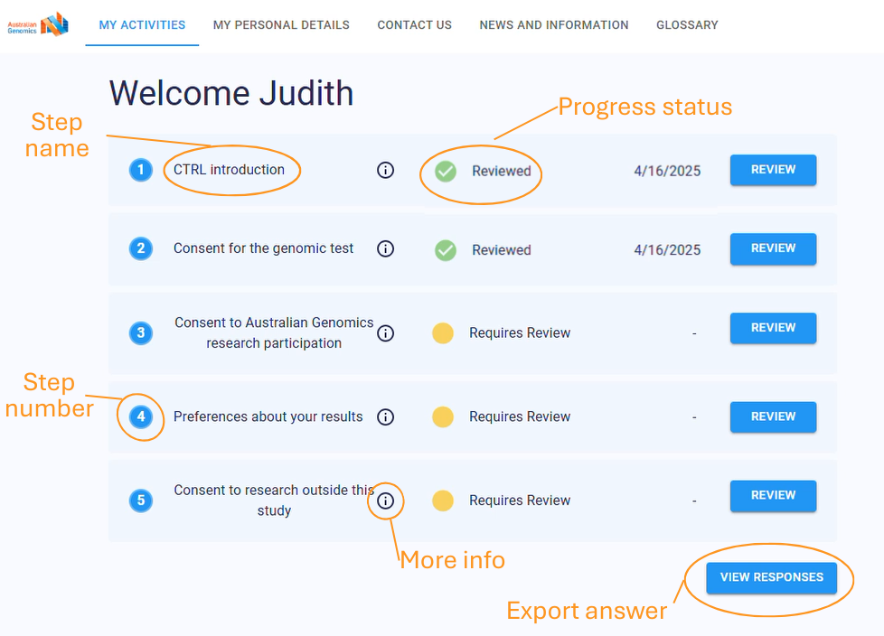
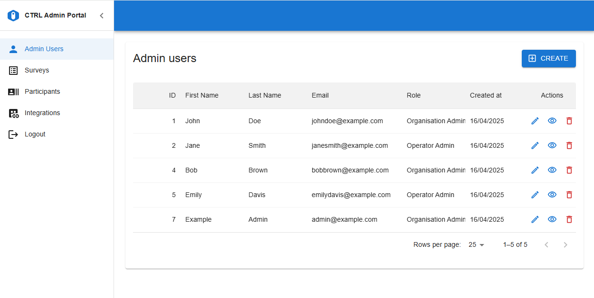

# ctrl-next

ctrl-next is the next incarnation of the dynamic consent platform CTRL developed by Australian Genomics and the Garvan Institute of Medical Research, designed to deliver new features in a faster and more robust way through the use of modern web technologies.

## About CTRL
CTRL is a secure, web-based dynamic consent platform that empowers research participants to manage their consent preferences, update personal details, and make informed decisions about the use of their genomic and health data. For research organizations, CTRL streamlines consent management by replacing paper records with electronic ones, offering interoperability with databases like REDCap, and managing permissions using international standards.

CTRL has recently undergone a major upgrade, featuring a modern interface, scalable backend, and new capabilities for both participants and research teams. The platform supports automated consent capture, secure audit logging, and flexible integration options.

**Current capabilities:**
- Participant Portal for managing consent preferences
- Automated digital consent capture and secure audit logging
- Integration with REDCap and standalone operation

**Upcoming features:**
- Enhanced consent transition management (e.g., for participants reaching adulthood)
- Automated participant communications
- Real-time dashboards and analytics
- Expanded integrations (including Elsa)
- A revamped Admin Portal with real-time monitoring, automated alerts, and improved security

**Guardians Affiliation**

INFO ABOUT GUARDIANS

[Newsletter update &rarr;](https://www.australiangenomics.org.au/streamlined-consent-management-inside-the-new-ctrl-platform/)

[Video Demonstration &rarr;](https://www.youtube.com/watch?v=peQf_Gxhvq4)

[Learn more about CTRL &rarr;](https://www.australiangenomics.org.au/tools-and-resources/dynamic-consent-and-ctrl/)

## Demo Environment

#### Participant Portal

The Participant Portal allows individuals to provide, review, and update their consent preferences at any time, ensuring active engagement throughout a study.

[Participant Portal Demo Site &rarr;](https://ctrldemo.dsp.garvan.org.au/login)

#### Admin Portal
The Admin Portal enables research teams to efficiently manage participant registrations, monitor consent completions, and track changes in real time, with enhanced security and workflow tools.

[Admin Portal Demo Site &rarr;](https://admin.ctrldemo.dsp.garvan.org.au/login)

_**NOTE:** Demo sites are under active development and may not work as expected at times._

## Want to contribute?
Have a look through existing [issues](https://github.com/Garvan-Data-Science-Platform/ctrl-next/issues) for anything that you could help with. If you'd like to request a feature or report a bug, please create a GitHub Issue using one of the templates provided.

[See contribution guide &rarr;](https://github.com/Garvan-Data-Science-Platform/ctrl-next/blob/main/docs/CONTRIBUTING.md)
